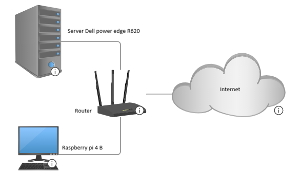

# My-Homelab 💻👨‍💻

## Overview

This repository documents my personal homelab, which I use to learn and experiment with Linux, virtualization, networking, Docker, AI, and self-hosted services.
| Component | Technology |
| --- | ----------- |
| Hypervisor | Proxmox VE |
| Server | Dell PowerEdge R620 |
| CPU | 2× Intel Xeon E5-2630 v2 |
| RAM | 128 GB |
| GPU | NVIDIA Tesla P4 |
| OS | Debian / Ubuntu |
| SBC | Raspberry pi 4 B |
| Remote Access | Tailscale |

## Services & Purpose 

| Service | Purpose | Platform |
| --- | ----------- | -------- |
| Pi-hole | Blocks DNS queries to known ad/tracking domains | Raspberry pi |
| Tailscale | Allows me to access any of my services remotely when outside the network | Raspberry pi |
| Uptime Kuma | Allows me to monitor the status of services to see if they are up or down | Raspberry pi |
| Proxmox | Virtualization | Dell poweredge R620 |
| Open WebUI | Running my local hosted LLM by ollama  | Dell poweredge R620 |
| Crafty Controller | Web-based management and hosting of Minecraft servers | Dell PowerEdge R620 |
| playit.gg | Provides a public tunnel for the Minecraft server without traditional port forwarding | Raspberry Pi |

## Virtualization
<ul>
<li>AI and Robotic:
  <ul>
  <li>Directly connected to The GPU</li>
  <li>It is used for personal AI projects and Robotic project involving Gazebo</li>
  </ul>
</li>
<li>Hosting:
    <ul><li>Used for hosting webservers, email servers, database server, Minecraft server, and jellyfin server</li></ul>
</li>
</ul>

## Architecture

## Networking

The homelab uses a local network with the Raspberry Pi providing several
networking and monitoring services.

### Remote Access
- Tailscale is used for secure remote access to the homelab.
- Services can be accessed remotely without exposing management ports
  directly to the public internet.

### DNS
- Pi-hole provides local DNS filtering and ad/tracker blocking.

### Minecraft
- playit.gg provides a public tunnel for the Minecraft server,
  avoiding traditional port forwarding.
